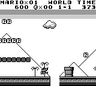

# Train RL Mario AGENT


[](https://img.shields.io/github/actions/workflows/status/l4nz8/q_play/main.yml)


[Grading PDF](./assets/GutachtenVincent.pdf)

## Introduction 🚀
This project implements a Reinforcement Learning (RL) agent that plays "Super Mario Land" using a Double Deep Q-Network (DDQN). It's built on the PyBoy Game Boy emulator, providing a custom environment for the Mario AI to interact with and learn from. The agent is designed to navigate through the levels of "Super Mario Land," making decisions based on the current state of the game to maximize its reward score and progress.

<table>
  <tbody>
    <!-- Gif -->
    <tr>
      <td align="center">
        <br>
      </td>
    </tr>
    <!-- Description -->
    <tr>
      <td align="center">
        <strong>72h trained model</strong>
      </td>
    </tr>
  </tbody>
</table>

---

## Table of Contents 📖
1. [Introduction](#introduction-)
2. [Overview](#overview)
3. [Getting Started](#getting-started-)
4. [Download and Install](#download-and-install)
5. [Run Emulator and AI](#run-emulator-and-ai-)
6. [Tracking Training Progress](#tracking-training-progress-)
7. [Pre Trained models](#pre-trained-models-)
8. [Documentation](#documentation-)
9. [Based On](#based-on)

---

## Overview
The MARIO-PLAYING RL AGENT uses a DDQN model for decision-making and operates within a custom gym environment tailored around "Super Mario Land". The agent's goal is to learn optimal strategies for navigating the game's levels, overcoming obstacles, and maximizing scores through trial and error.

### Features
- **Double Deep Q-Network:** Utilizes a DDQN architecture for stable and efficient learning.
- **Custom Gym Environment:** Integrates with PyBoy to create a tailored environment for Super Mario Land.
- **Flexible Training Modes:** Supports both training and playing modes for the AI agent.
- **Headless Training:** Offers a headless mode for faster training without rendering the game screen.
- **Customizable Hyperparameters:** Allows tweaking of learning rates, exploration rates, and more.

## Getting Started 💻

🐍 Python 3.10 is recommended. Other versions may work but have not been tested.
- It is also recommended to use cuda for training, which you must install manually for your individual GPU.

### Download and Install
1. Clone the repository to your local machine:
```bash
git clone https://github.com/l4nz8/q_play.git
```
2. Install dependencies:
```bash
cd q_play
pip3 install -r requirements.txt
```
3. Copy your legally obtained Super Mario Land ROM into the gb_ROM/ directory. You can find this using google, it should be 66KB in size. Rename it to `SuperMarioLand.gb` if it is not already. The sha1 sum should be `418203621b887caa090215d97e3f509b79affd3e`, which you can verify by running `shasum SuperMarioLand.gb` inside the terminal. 

Note: The SuperMarioLand.gb file MUST be in the `gb_ROM/` directory and your current directory MUST be the `q_play/` root directory in order for this to work.

## Run Emulator and AI 🎮

### Run AI Agent

The script must be started from the root directory `q_play/` in the terminal.
```bash
python baseline/main.py -h
```
The project contains several argparse start conditions, which are described in more detail with the `-h` help argument after the initialization of the script.  

```usage: main.py [-h] [--world WORLD | --level LEVEL] [-m {train,play}] [--headless] [-ls] [-los] [-lrs {StepLR,Cyclic}] [-exp EXPLORATION] [--debug]```

Note:  
- If the script is started without start conditions, the training mode `-m train` is automatically executed with default settings.
- To start a new training session, make sure that there is no `checkpoints/` folder or `.chkpt` file in the folder.
- If there are several models in the `checkpoints/` folder, you will be asked which model should be used to train/play with, depending on which `-m` the script was executed in.

### Tracking Training Progress 📈

To monitor the logged metrics you neet to run Tensorboard from to root directory `q_play/` and have it aktive in the terminal.
```bash
tensorboard --logdir=runs
```
Access the dashboard through `http://localhost:6006/` in your web browser (safari is not supported).  
All runs are saved in the `runs/` directory.  

Note: Refreshing the training progress must be done manually in tensorboard.

### Pre Trained models 👾

To use a pre-trained model, download the `checkpoints/` folder from the google.docs link below and paste it into the `q_play/` root directory.

**[checkpoints/](https://drive.google.com/drive/folders/1_vqTBNQzlyZl7kOxnsa1q9clRLtB_jYo?usp=sharing)**

The same with the logged metrics `runs/` folder.

**[runs/](https://drive.google.com/drive/folders/14unJWiTpiiosiZAdMJgtgAOWTQpkiza2?usp=sharing)**

## Documentation 🍰
If you want to know more about the project read the documentation:  

**[Documentation: (English)](https://docs.google.com/document/d/15uUgVP8PJc9lO-45dp5YI16WE9ySOaVecNvU2sPuxXs/edit?usp=sharing)**

**[Documentation: (German)](https://docs.google.com/document/d/171trtRc4DkKr2gHy8AyJ_wlJQH4CMmkPqxXyICp6Mqw/edit?usp=sharing)**

### Presentation:

**[Presentation: (German)](https://www.canva.com/design/DAF9PVRl6no/9ulZRffVRH0LGy5jfWjNhQ/edit?utm_content=DAF9PVRl6no&utm_campaign=designshare&utm_medium=link2&utm_source=sharebutton)**

## Based on
### [DDQN](https://arxiv.org/abs/1509.06461)

### [PyTorch RL Super Mario Bros Example](https://pytorch.org/tutorials/intermediate/mario_rl_tutorial.html)

<a href="https://github.com/Baekalfen/PyBoy">
  
</a>
